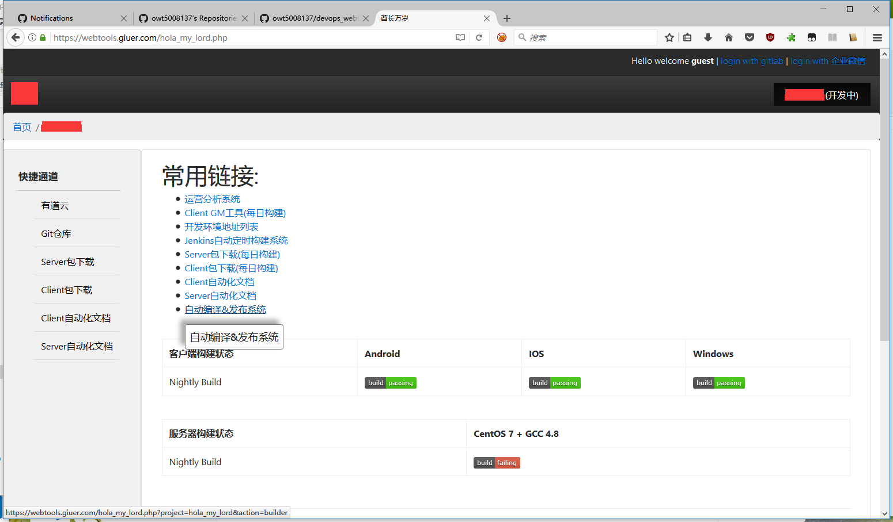
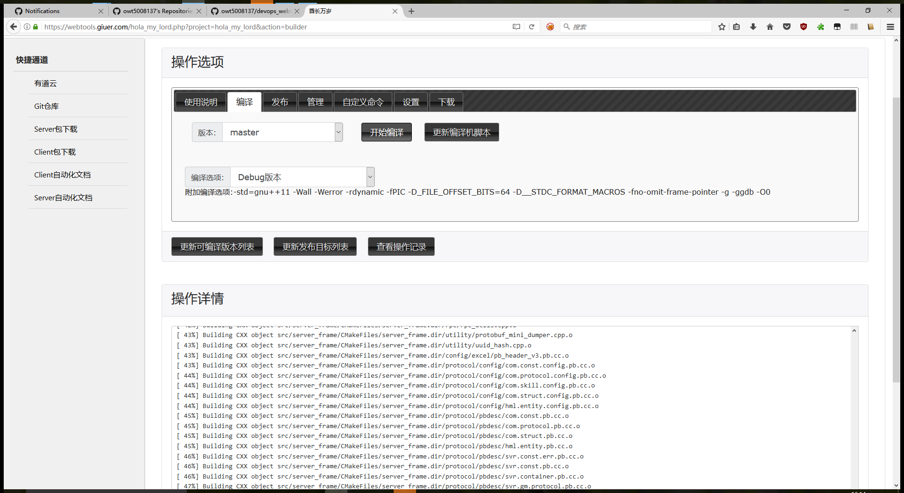
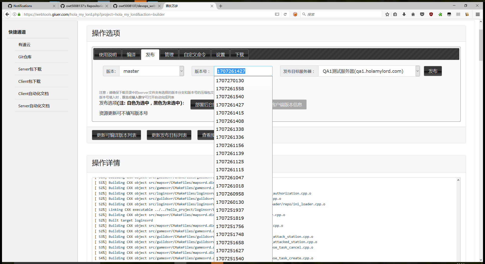

# devops_webtools
开发运维工具-用于内网开发环境服务器发布和管理

仅支持Linux+PHP环境。且默认shell为bash。

## 使用的第三方库列表

+ [jquery](//jquery.com/)
+ [jquery ui](//jqueryui.com/)
+ [vue.js](//vuejs.org/)
+ [momentjs](//momentjs.com/)
+ [bootstrap v4](//getbootstrap.com)
+ [highlight.js](//highlightjs.org/)
+ [jqplot](//www.jqplot.com/) *(仅OSS模块使用)*

## 截图示例

